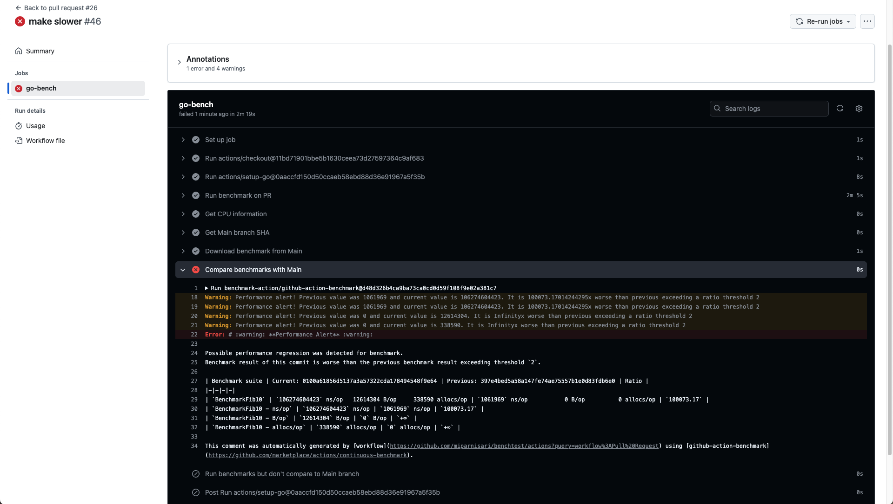

## Running benchmarks reliably with GitHub action

This repo shows this workflow:

1. Run benchmarks for your Go code (`func Bench...`) in the `main` branch and in PRs.
2. On every commit to a PR, it compares the benchmark results against `main`:
   1. if no `main` benchmarks are available, just publish benchmarks in the summary of the PR.
   2. if there `main` benchmarks, and they got worse in the PR, **fail the PR**:

